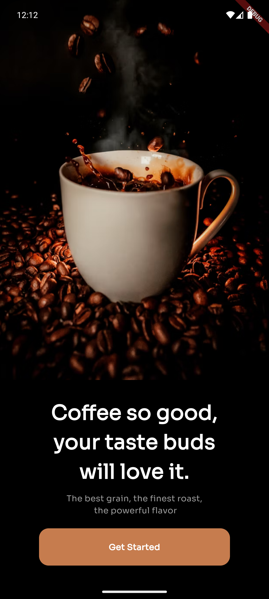
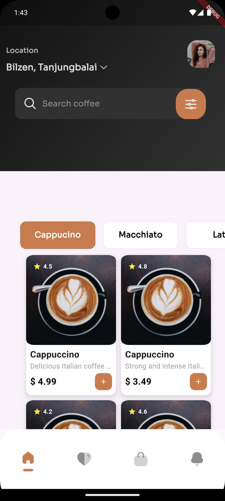
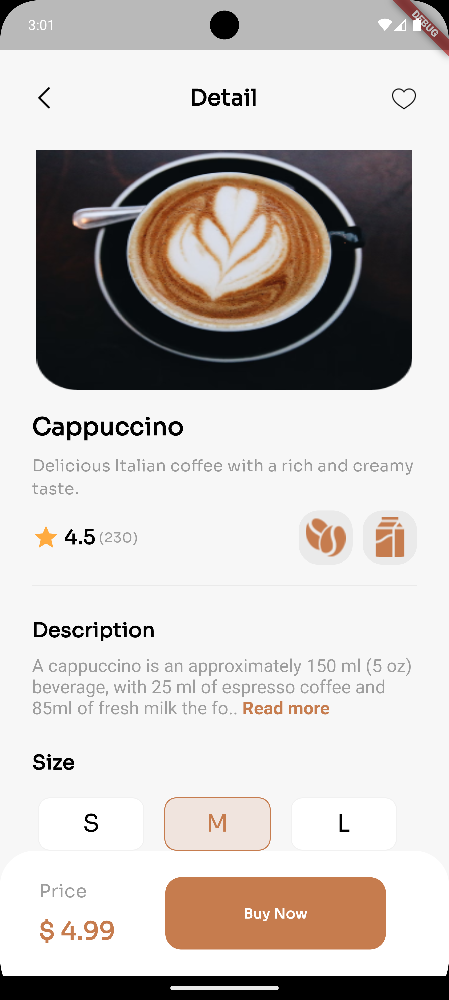

# Coffee Shop App

## Table of Contents
- [Overview](#overview)
- [Screenshots](#screenshots)
- [Installation](#installation)
- [Usage](#usage)

## Overview
The Coffee Shop App is a Flutter-based application that allows users to order and have their coffees delivered to them at their location.

## Screenshots
  
*This is the UI of the Onboarding Screen*

  
*This is the UI of the Home Screen*

  
*This is the UI of the Coffee Shop Details Screen*

  
*This is the UI of the Coffee Shop Order Screen*


## Installation
To run this project, clone the repository and follow the instructions below:

```bash
git clone https://github.com/Prodigy-Genes/cofeeShop.git
cd cofeeShop
flutter pub get
```


### Running the App

```bash
flutter run
```
